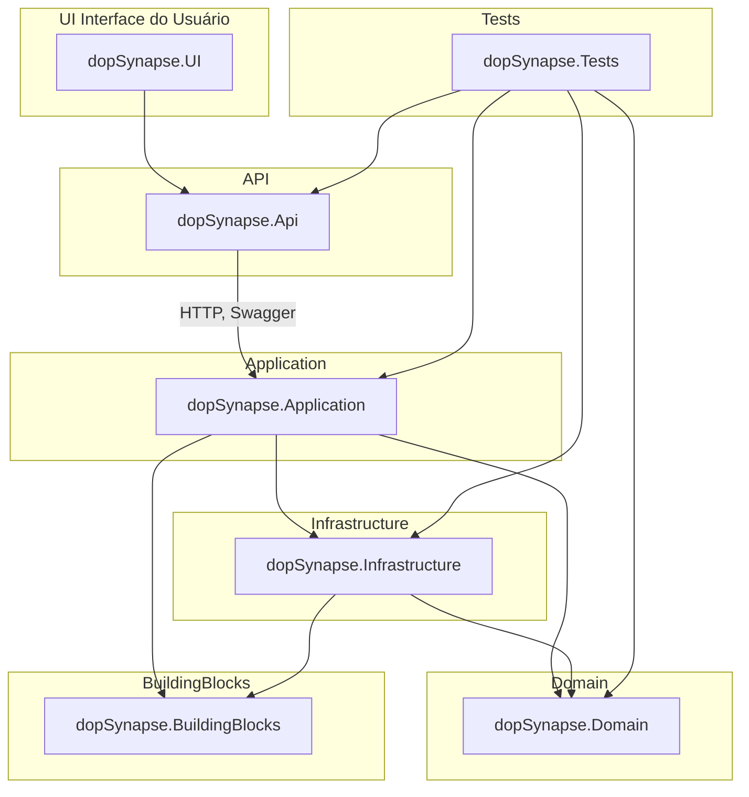

# dopSynapse

Arquitetura modular e escalável em .NET, com foco em mensageria, observabilidade e interoperabilidade para microsserviços modernos.

O **dopSynapse** é um projeto base estruturado para suportar aplicações corporativas com alta complexidade, fornecendo separação clara de responsabilidades em camadas, suporte a múltiplos bancos de dados (relacionais e não-relacionais), integração com sistemas externos, autenticação, monitoramento e muito mais.

## Índice

1. [Visão Geral](#visão-geral)
2. [Instalação](#instalação)
3. [Como Usar](#como-usar)
4. [Arquitetura](#arquitetura)
5. [Contribuições](#contribuições)
6. [Licença](#licença)
7. [Contato](#contato)

## Visão Geral

O **dopSynapse** representa um modelo arquitetural baseado em boas práticas como Clean Architecture, Domain-Driven Design (DDD), SOLID, separação de contextos (Bounded Contexts) e uso de padrões modernos como CQRS, Event Sourcing, mensageria assíncrona e integração com observabilidade (OpenTelemetry, Health Checks, Logs estruturados etc).

### Principais funcionalidades:

* Camadas bem definidas: `UI`, `API`, `Application`, `Domain`, `Infrastructure`, `Tests`
* Suporte a bancos **relacionais** (SQL Server, PostgreSQL, MySQL) e **não-relacionais** (MongoDB, Redis, Cassandra, Elasticsearch)
* Mensageria com Kafka, RabbitMQ, Azure Service Bus
* Autenticação via JWT, OAuth, IdentityServer, Keycloak
* Observabilidade com Logs, Metrics, Traces e HealthChecks
* Estrutura pronta para CI/CD, testes automatizados, deploy via Docker/K8s

## Instalação

Perfeito! Aqui está a seção **Pré-requisitos** atualizada com as principais IDEs recomendadas para trabalhar com o projeto `dopSynapse`:

### Pré-requisitos

Antes de começar, certifique-se de ter os seguintes itens instalados em seu ambiente de desenvolvimento:

#### SDKs e Ferramentas

* [.NET 7 SDK](https://dotnet.microsoft.com/en-us/download)
* [Git](https://git-scm.com)
* [Docker](https://www.docker.com) & [Docker Compose](https://docs.docker.com/compose/)

#### IDEs Recomendadas

As seguintes IDEs podem ser utilizadas para desenvolvimento completo do `dopSynapse`, incluindo backend e frontend (UI):

* **[Visual Studio 2022+](https://visualstudio.microsoft.com/pt-br/)**
  Recomendado para desenvolvimento full stack com suporte total a .NET, MAUI, Blazor, WinForms, WPF e testes.
  Extensões úteis:

  * C# Dev Kit
  * NuGet Package Manager
  * Docker Tools
  * GitHub Extension

* **[Rider (JetBrains)](https://www.jetbrains.com/rider/)**
  IDE moderna e multiplataforma com suporte avançado a projetos .NET, integrações com Docker, Git e testes automatizados.

* **[Visual Studio Code](https://code.visualstudio.com/)**
  Leve e extensível. Ideal para desenvolvimento modular, especialmente para camadas como `Infrastructure`, `Application` e testes.
  Extensões recomendadas:

  * C# (OmniSharp)
  * .NET Install Tool
  * Docker
  * GitLens
  * Thunder Client ou REST Client para testes de API

### Clonando o repositório

```bash
git clone https://github.com/daniloopinheiro/dopSynapse.git
cd dopSynapse
```

### Subindo a infraestrutura base com Docker

```bash
docker-compose up -d
```

## Como Usar

### Executar a API localmente

```bash
cd dopSynapse.Api
dotnet run
```

A API estará disponível em: `https://localhost:5001`
Swagger UI: `https://localhost:5001/swagger`

### Rodar testes

```bash
dotnet test
```

## Arquitetura Synapse



### Organização dos diretórios

```
Projects/
│
├── dopSynapse.UI/                         # Camada de interface do usuário
│   ├── BlazorApp/                         # Aplicação web com Blazor (Server ou WASM)
│   ├── MAUIApplication/                   # Aplicação mobile/desktop com .NET MAUI
│   ├── WPFApp/                            # Aplicação desktop WPF (Windows Presentation Foundation)
│   ├── WinUIApp/                          # Aplicação com WinUI (Windows moderno)
│   ├── UWPApp/                            # Aplicação UWP (Universal Windows Platform)
│   └── WinFormsApp/                       # Aplicação tradicional com Windows Forms
│
├── dopSynapse.Api/                        # Camada de exposição HTTP
│   ├── Controllers/
│   ├── Middlewares/
│   ├── Configurations/
│   └── Program.cs / Startup.cs
│
├── dopSynapse.Application/                # Casos de uso, serviços e orquestrações
│   ├── Interfaces/
│   ├── UseCases/
│   ├── DTOs/
│   ├── Validators/
│   ├── Events/
│   ├── Services/
│   ├── Extensions/
│   └── Mappings/
│
├── dopSynapse.Domain/                     # Regra de negócio central
│   ├── Entities/
│   ├── ValueObjects/
│   ├── Enums/
│   ├── Interfaces/
│   ├── Services/
│   ├── Events/
│   ├── Exceptions/
│   ├── Specifications/
│   ├── Aggregates/
│   └── Extensions/
│
├── dopSynapse.Infrastructure/             # Implementações técnicas de persistência, mensageria, etc.
│   ├── Data/
│   ├── Messagings/
│   ├── Auths/
│   ├── Observabilities/
│   ├── Servers/
│   ├── Configuration/
│   └── Extensions/
│
├── dopSynapse.Tests/                      # Testes automatizados
│   ├── Unit/
│   ├── Integration/
│   └── Mocks/
│
└── dopSynapse.BuildingBlocks/             # Pacotes genéricos reutilizáveis
    ├── EventBus/
    ├── Mediator/
    ├── Notifications/
    └── Extensions/
```

## Contribuições

Contribuições são muito bem-vindas!

### Como contribuir:

1. Faça um fork do projeto
2. Crie uma branch: `git checkout -b feature/nova-funcionalidade`
3. Commit suas mudanças: `git commit -m 'feat: nova funcionalidade'`
4. Push para a branch: `git push origin feature/nova-funcionalidade`
5. Abra um Pull Request

Para bugs, melhorias e dúvidas, utilize as [issues](https://github.com/daniloopinheiro/dopSynapse/issues).

## Licença

Este projeto está licenciado sob a [Licença MIT](LICENSE).

## Contato

Tem dúvidas ou quer colaborar com o projeto? Fale comigo:

* **Email Pessoal**: [daniloopro@gmail.com](mailto:daniloopro@gmail.com)
* **Email Empresarial**: [devsfree@devsfree.com.br](mailto:devsfree@devsfree.com.br)
* **Email Consultoria**: [contato@dopme.io](mailto:contato@dopme.io)
* **LinkedIn**: [Danilo O. Pinheiro](https://www.linkedin.com/in/daniloopinheiro/)

Desenvolvido por **Danilo O. Pinheiro** • DevsFree • dopme.io
