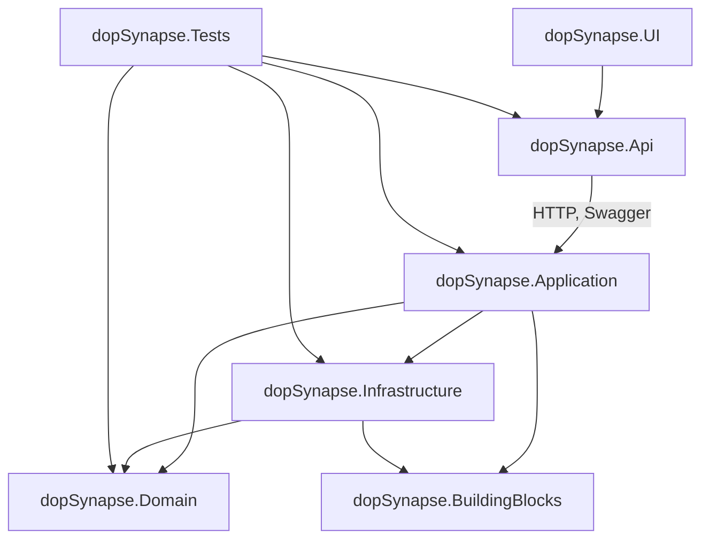

# dopSynapse

**Arquitetura modular e escalável em .NET**, com foco em mensageria, observabilidade e interoperabilidade para microsserviços modernos.

O `dopSynapse` é um projeto base estruturado para aplicações corporativas com alta complexidade. Ele oferece separação clara de responsabilidades, suporte a múltiplos bancos de dados (relacionais e não-relacionais), integração com sistemas externos, autenticação, monitoramento e muito mais.

---

## Índice

1. [Visão Geral](#visão-geral)
2. [Instalação](#instalação)
3. [Como Usar](#como-usar)
4. [Arquitetura](#arquitetura-synapse)
5. [Contribuições](#contribuições)
6. [Licença](#licença)
7. [Contato](#contato)

---

## 🔍 Visão Geral

O `dopSynapse` segue princípios como **Clean Architecture**, **Domain-Driven Design (DDD)**, **SOLID**, **Bounded Contexts**, e aplica padrões modernos como:

* CQRS (Command Query Responsibility Segregation)
* Event Sourcing
* Mensageria assíncrona
* Observabilidade com OpenTelemetry
* Health Checks, Logs estruturados e Métricas

### Principais funcionalidades:

✅ Camadas bem definidas: `UI`, `API`, `Application`, `Domain`, `Infrastructure`, `Tests`

✅ Suporte a bancos **relacionais** (SQL Server, PostgreSQL, MySQL) e **não-relacionais** (MongoDB, Redis, Cassandra, Elasticsearch)

✅ Integração com Kafka, RabbitMQ, Azure Service Bus

✅ Autenticação via JWT, OAuth, IdentityServer, Keycloak

✅ Monitoramento com Logs, Metrics, Traces e HealthChecks

✅ Estrutura pronta para CI/CD, testes automatizados, deploy via Docker/Kubernetes

---

## Instalação

### Pré-requisitos

#### SDKs e Ferramentas

* [.NET 7 SDK](https://dotnet.microsoft.com/en-us/download)
* [Git](https://git-scm.com)
* [Docker](https://www.docker.com) e [Docker Compose](https://docs.docker.com/compose/)

#### IDEs Recomendadas

| IDE                     | Recomendada para                                                                |
| ----------------------- | ------------------------------------------------------------------------------- |
| **Visual Studio 2022+** | Desenvolvimento full stack com .NET, MAUI, Blazor, testes, Docker e GitHub      |
| **JetBrains Rider**     | IDE multiplataforma com suporte avançado a projetos .NET, Docker e testes       |
| **VS Code**             | Leve e modular. Ideal para `Application`, `Infrastructure`, testes e containers |

##### Extensões úteis para VS Code:

* C# (OmniSharp)
* .NET Install Tool
* Docker
* GitLens
* Thunder Client ou REST Client

### Clonando o repositório

```bash
git clone https://github.com/daniloopinheiro/dopSynapse.git
cd dopSynapse
```

### Subindo a infraestrutura base com Docker

```bash
docker-compose up -d
```

---

## Como Usar

### Executar a API localmente

```bash
cd dopSynapse.Api
dotnet run
```

* Swagger UI: [https://localhost:5001/swagger](https://localhost:5001/swagger)

### Rodar testes automatizados

```bash
dotnet test
```

---

## Arquitetura Synapse



---

### Organização dos diretórios

```
Projects/
│
├── dopSynapse.UI/                 # Interface do usuário
│   ├── BlazorApp/                # Web (Server/WASM)
│   ├── MAUIApplication/          # Mobile/Desktop (MAUI)
│   ├── WPFApp/                   # Windows Desktop (WPF)
│   ├── WinUIApp/                 # Windows UI moderno
│   ├── UWPApp/                   # Plataforma Universal do Windows
│   └── WinFormsApp/              # WinForms tradicional
│
├── dopSynapse.Api/               # Exposição HTTP
│   ├── Controllers/
│   ├── Middlewares/
│   ├── Configurations/
│   └── Program.cs / Startup.cs
│
├── dopSynapse.Application/       # Casos de uso e orquestrações
│   ├── Interfaces/
│   ├── UseCases/
│   ├── DTOs/
│   ├── Validators/
│   ├── Events/
│   ├── Services/
│   ├── Extensions/
│   └── Mappings/
│
├── dopSynapse.Domain/            # Regras de negócio
│   ├── Entities/
│   ├── ValueObjects/
│   ├── Enums/
│   ├── Interfaces/
│   ├── Services/
│   ├── Events/
│   ├── Exceptions/
│   ├── Specifications/
│   ├── Aggregates/
│   └── Extensions/
│
├── dopSynapse.Infrastructure/    # Persistência, mensageria, observabilidade
│   ├── Data/
│   ├── Messagings/
│   ├── Auths/
│   ├── Observabilities/
│   ├── Servers/
│   ├── Configuration/
│   └── Extensions/
│
├── dopSynapse.Tests/             # Testes automatizados
│   ├── Unit/
│   ├── Integration/
│   └── Mocks/
│
└── dopSynapse.BuildingBlocks/    # Componentes genéricos e reutilizáveis
    ├── EventBus/
    ├── Mediator/
    ├── Notifications/
    └── Extensions/
```

---

## Contribuições

Contribuições são bem-vindas!

### Como contribuir

1. Fork este repositório
2. Crie uma branch: `git checkout -b feature/nova-funcionalidade`
3. Commit: `git commit -m 'feat: nova funcionalidade'`
4. Push: `git push origin feature/nova-funcionalidade`
5. Abra um **Pull Request**

Para bugs ou sugestões, abra uma [issue](https://github.com/daniloopinheiro/dopSynapse/issues).

---

## Licença

Este projeto está licenciado sob a [Licença MIT](LICENSE).

---

## Contato

Entre em contato para colaborações, dúvidas ou consultorias:

* **Pessoal**: [daniloopro@gmail.com](mailto:daniloopro@gmail.com)
* **Empresarial**: [devsfree@devsfree.com.br](mailto:devsfree@devsfree.com.br)
* **Consultoria**: [contato@dopme.io](mailto:contato@dopme.io)
* **LinkedIn**: [Danilo O. Pinheiro](https://www.linkedin.com/in/daniloopinheiro/)

> Desenvolvido por **Danilo O. Pinheiro** • [DevsFree](https://devsfree.com.br) • [dopme.io](https://dopme.io)
